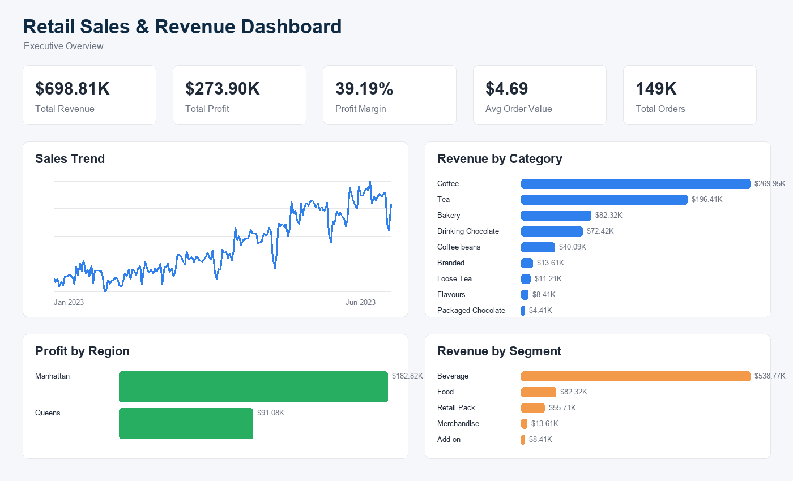
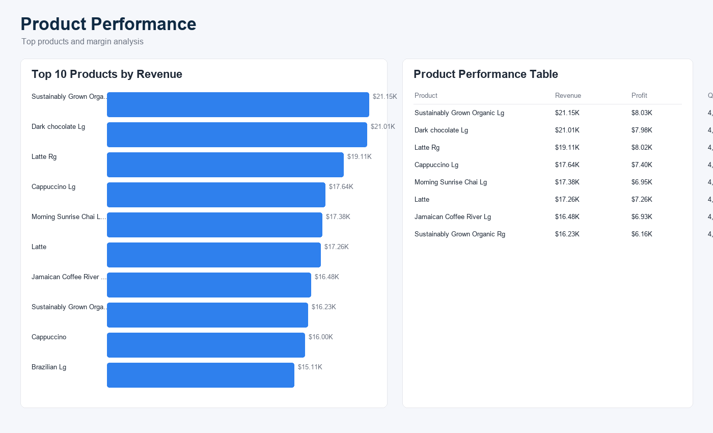
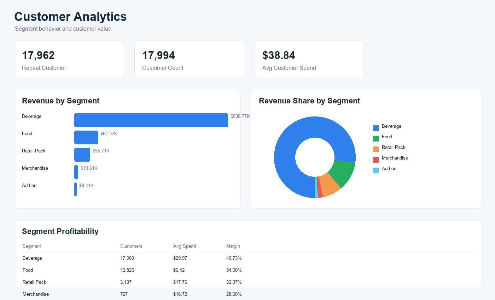
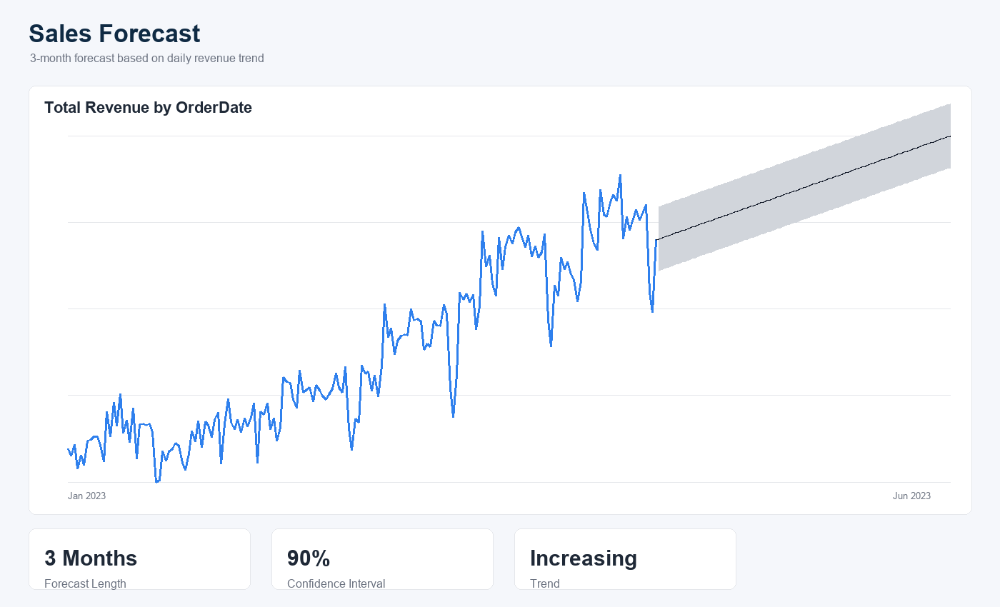

# Retail Sales & Revenue Dashboard

Power BI dashboard project for analyzing retail sales, revenue, product performance, customer segments, and sales forecast.

## A. Business Problem

Retail managers need to monitor revenue, profit, product performance, customer behavior, and sales trends in order to make faster business decisions.

This dashboard was built to visualize key business KPIs and support performance analysis across time, products, regions, and customer segments.

The dashboard helps answer:

- How much revenue and profit did the business generate?
- Which product categories drive the most revenue?
- Which regions or store areas are more profitable?
- Which products are best sellers?
- Which customer segments bring the most value?
- What is the expected sales trend for the next few months?

## B. Dataset

Source: [Coffee Shop Sales Dataset - Kaggle](https://www.kaggle.com/datasets/ahmedabbas757/coffee-sales/data)

Records: `149,116`

Period: `2023-01-01` to `2023-06-30`

Main fields:

- Order Date
- Revenue
- Profit
- Quantity
- Product Category
- Product Name
- Customer Segment
- Customer ID
- Region
- Store Location

Notes:

- The original dataset includes transaction-level coffee shop sales data.
- Revenue was calculated from quantity and unit price.
- Profit, customer, region, and segment fields were created during data preparation to support business analysis.

## C. KPI

Main KPIs used in the dashboard:

- Total Revenue
- Total Profit
- Profit Margin
- Total Orders
- Average Order Value
- Total Quantity
- Customer Count
- Repeat Customer

KPI summary:

| KPI | Value |
| --- | ---: |
| Total Revenue | $698.81K |
| Total Profit | $273.90K |
| Profit Margin | 39.19% |
| Total Orders | 149K |
| Average Order Value | $4.69 |
| Quantity Sold | 214,470 |

## D. Dashboard Pages

1. Executive Overview
2. Product Performance
3. Customer Analysis
4. Sales Forecast

## E. Key Insights

- Coffee generated the highest revenue at about `$269.95K`.
- Tea was the second-largest revenue category at about `$196.41K`.
- Beverage products contributed the largest share of total revenue.
- Manhattan generated higher profit than Queens.
- Sales increased steadily from January to June 2023.
- The forecast page shows a continued upward revenue trend for the next 3 months.
- Some product groups have strong revenue contribution but should still be monitored for margin performance.

## Dashboard Preview

### Executive Overview



### Product Performance



### Customer Analysis



### Sales Forecast



## DAX Measures

```DAX
Total Revenue =
SUM(Sales[Revenue])
```

```DAX
Total Profit =
SUM(Sales[Profit])
```

```DAX
Profit Margin =
DIVIDE([Total Profit], [Total Revenue])
```

```DAX
Total Orders =
DISTINCTCOUNT(Sales[OrderID])
```

```DAX
Average Order Value =
DIVIDE([Total Revenue], [Total Orders])
```

```DAX
Customer Count =
DISTINCTCOUNT(Sales[CustomerID])
```

```DAX
Repeat Customer =
VAR CustomerOrderTable =
    SUMMARIZE(
        Sales,
        Sales[CustomerID],
        "OrderCount", DISTINCTCOUNT(Sales[OrderID])
    )
RETURN
    COUNTROWS(FILTER(CustomerOrderTable, [OrderCount] > 1))
```

## Business Recommendations

- Focus on Coffee and Tea categories because they are the main revenue drivers.
- Monitor lower-revenue categories such as Packaged Chocolate, Flavours, and Loose Tea to decide whether to improve promotion or reduce inventory focus.
- Review pricing and margin assumptions for high-revenue products to ensure revenue growth also improves profitability.
- Use regional performance to prioritize operational support for high-profit store areas.
- Increase upsell and cross-sell activities for beverage customers because Beverage is the strongest segment.
- Track sales trend monthly and compare actual sales with forecast to detect early signs of declining demand.

## Tools Used

- Power BI Desktop
- Power Query
- DAX
- Excel / CSV
- Python
- GitHub

## Project Files

```text
Retail-Sales-Revenue-Dashboard/
│
├── data/
│   ├── raw/
│   │   └── Coffee Shop Sales.xlsx
│   └── processed/
│       └── coffee_shop_sales_clean.csv
│
├── images/
│   ├── overview.png
│   ├── product-analysis.png
│   ├── customer-analysis.png
│   └── forecast.png
│
├── powerbi/
│   ├── Retail Sales Revenue Dashboard/
│   │   └── Retail Sales Revenue Dashboard.pbix
│   ├── dax_measures.dax
│   └── theme_retail_corporate.json
│
├── scripts/
│   ├── download_dataset.ps1
│   ├── prepare_data.py
│   └── generate_readme_images.py
│
└── docs/
    └── dashboard_build_guide.md
```

## How to Open

Open the Power BI dashboard file:

```text
powerbi/Retail Sales Revenue Dashboard/Retail Sales Revenue Dashboard.pbix
```

If the report needs to be rebuilt, load the cleaned dataset:

```text
data/processed/coffee_shop_sales_clean.csv
```

Then recreate the measures from:

```text
powerbi/dax_measures.dax
```
